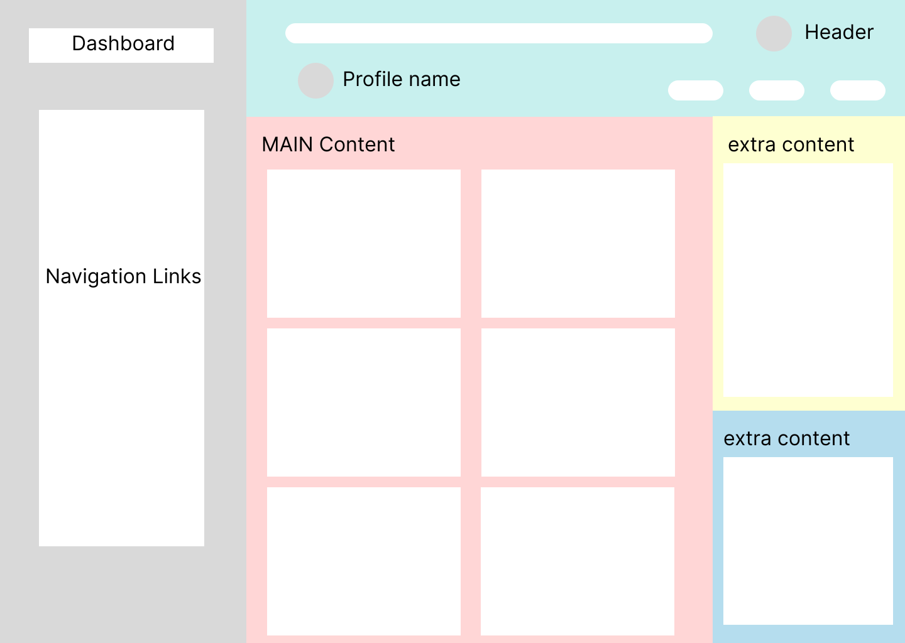
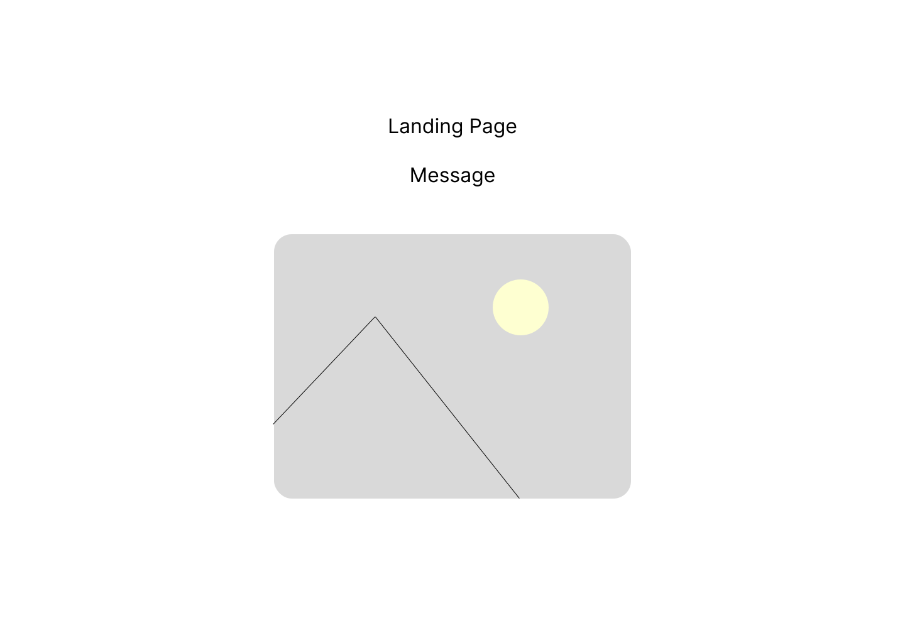
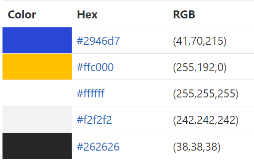

# Dashboard
An assignment to showcase knowledge on using CSS Grid. It is part of Brainnest Advanced Front-End Training Program.

The live site can be found [here](https://jtm2021.github.io/Dashboard/).

## Wireframe
The wireframe for the project was made using [Figma](https://www.figma.com/).

Click To See Wireframe

### Homepage

### Landing

## Typography
The project used fron Inder from [Google Fonts](https://fonts.google.com/).

## Color Scheme

The colors used in the project is based on dark blue yellow color palette. They were taken from [color-hex](https://www.color-hex.com/color-palette/83349). The colors are as follows:
 

## Images

The icons used in the project were taken from [Material Design Icons](https://materialdesignicons.com/)

Other images were taken from [Pexels](https://www.pexels.com/)

## Deployment

## Contributors

    1. Jesson Mangilisan
    2. Valter Carvalho
    3. Oluwagbemi Oluwasakin
